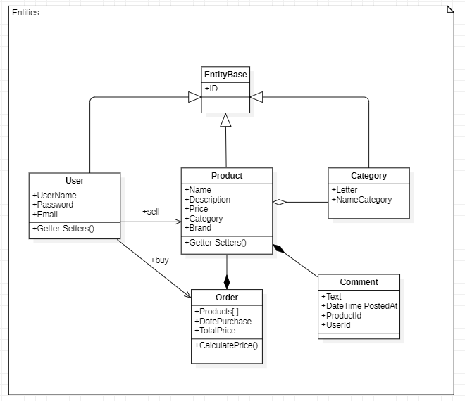
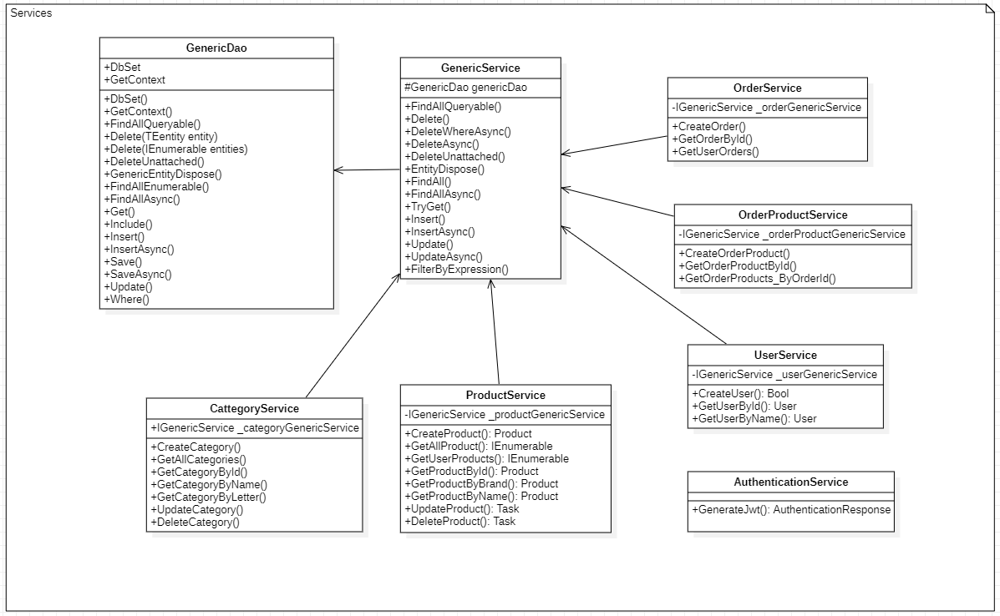
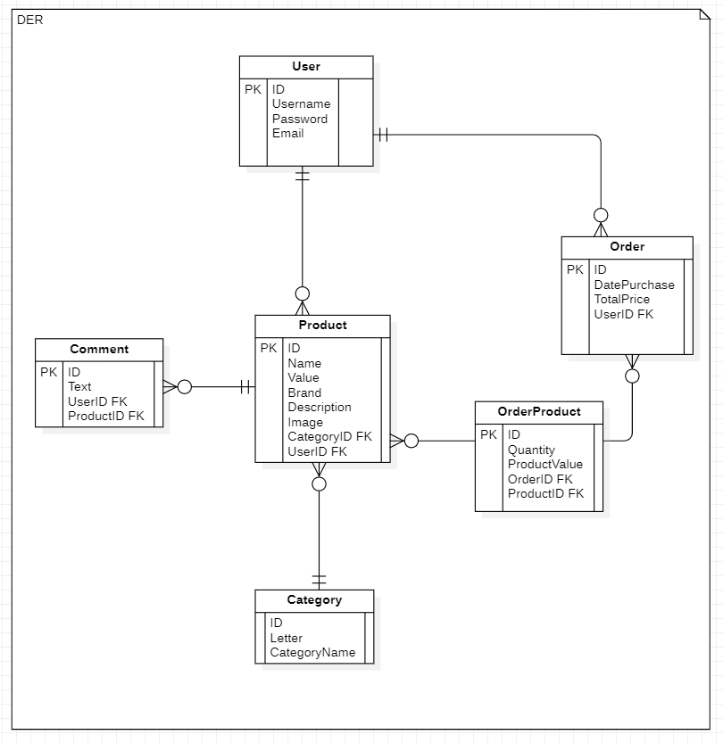

#🛒 eCommerce API
Este es un proyecto de API RESTful para un sistema de eCommerce, desarrollado con ASP.NET Core en el backend y React en el frontend. La aplicación permite gestionar productos, comentarios y órdenes de compra, integrando autenticación y autorización para usuarios registrados.

##🧾 Descripción
El backend está construido en C# con ASP.NET Core, utilizando Entity Framework Core como ORM y PostgreSQL como base de datos relacional. La API expone endpoints para la gestión de productos, comentarios, órdenes y usuarios, con distinción entre usuarios anónimos y registrados.

## 🚀 Funcionalidades
Usuarios anónimos: pueden visualizar productos y comentarios.

Usuarios registrados:

- Publicar nuevos productos.

- Comentar productos.

- Generar órdenes de compra.

## 🔐 Seguridad y Autenticación
- Encriptación de contraseñas con SHA-256.

- Autenticación y autorización mediante tokens JWT con expiración.

- Protección de endpoints sensibles según roles de usuario.

## 🛠️ Arquitectura y buenas prácticas
Inyección de dependencias para mayor desacoplamiento y testeo.

- Implementación del patrón de diseño Generic Repository, mediante GenericService y GenericDao.

- Separación clara de capas (Controller, Service, DAO).

- Manejo de errores y respuestas estandarizadas.

## 📦 Tecnologías utilizadas
C# / ASP.NET Core

- Entity Framework Core

- PostgreSQL

- Swagger para documentación y pruebas de la API

## Diagramas UML
Diagrama de clases de la arquitectura de la API.

DER de la base de Datos 

